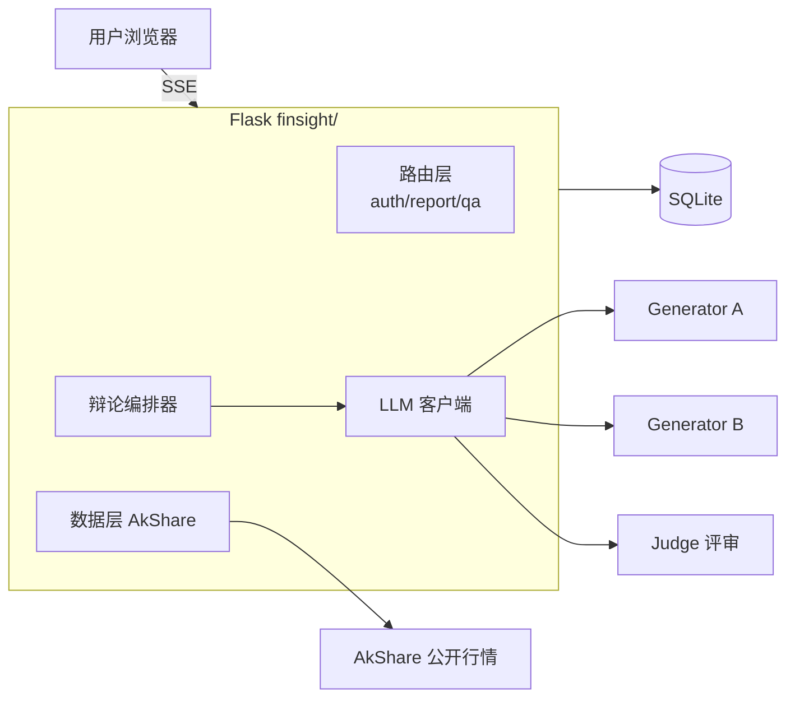
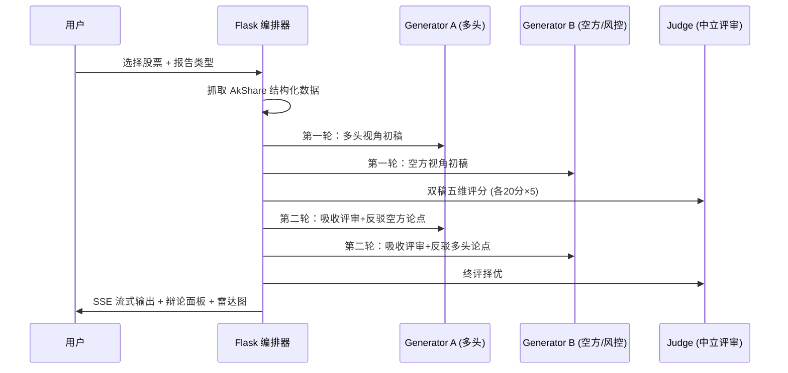

# FinSightPro

基于多 LLM 多空对抗辩论机制的 A 股智能研报生成与追问问答平台。


> ⚠️ **免责声明**：本项目及由本项目生成的所有内容仅供技术研究与学习参考，
> 不构成任何投资建议。市场有风险，投资需谨慎。详见 [DISCLAIMER.md](DISCLAIMER.md)。

## ✨ 核心特性

- **多空对抗辩论引擎** — Generator A 扮演多头研究员、Generator B 扮演空方/风控
  研究员，两轮对抗修订中必须正面回应对手论点；中立 Judge 按 5 维度
  （数据扎实/逻辑/清晰度/风险揭示/合规）打分择优，可通过 `DEBATE_MODE`
  一键切回平行视角模式
- **辩论过程全透明** — 「辩论过程」面板展示四份稿件得分、双方优势与短板、
  胜者，以及多空终稿的五维评分雷达图
- **行情可视化** — ECharts 渲染 AkShare 真实行情日 K 线与成交量
  （遵循 A 股「涨红跌绿」惯例）
- **全市场股票搜索** — 沪/深/北三市任意股票代码/名称模糊搜索，
  不再局限于预设列表
- **历史报告中心** — 全部已生成报告与最终评分一目了然，一键回看
- **四类研报模板** — 股票分析报告 / 前景分析 / 风险预测 / 行业市场分析，
  每类均有 10+ 章节的专业大纲约束
- **真实结构化数据支撑** — 基于 AkShare 抓取 A 股（沪深京三市）实时行情、
  历史走势、公司财务与行业快照，带本地缓存与组件级降级
- **真流式输出** — SSE 全程流式：OpenAI 协议 `stream=true` 逐 token 推送，
  服务商不支持时自动回退模拟分块
- **前端安全** — 所有 Markdown 渲染统一经 DOMPurify 消毒，防 XSS
- **报告追问问答** — 报告生成后可继续追问，模型结合报告内容与联网信息作答
- **自带微调闭环** — 附带 4 类金融分析指令微调数据（约 13MB）与
  Unsloth LoRA 训练脚本，可将自研模型接入辩论引擎
- **模型无关** — 兼容任意 OpenAI 协议服务商（DeepSeek / Qwen / GLM / Kimi /
  本地 vLLM），三个角色可分别配置不同模型

## 🏗 架构总览



详细设计见 [docs/architecture.md](docs/architecture.md)。

## 🚀 快速开始

```bash
git clone https://github.com/GOOD-123-CPU/finsightpro.git
cd finsightpro
pip install -r requirements.txt

# 配置
cp .env.example .env        # 然后编辑 .env 填入 LLM_API_KEY 等

# 启动
python run.py               # http://127.0.0.1:5231
```

首次启动自动建库，演示账号 `demo` / `password`。

> ⚠️ **部署安全提醒**：演示账号仅供首次体验，公网部署前请登录后删除该账号或修改其密码，并修改 `SECRET_KEY`。

> 完整部署（生产环境 / Docker / Nginx）见 [docs/deployment.md](docs/deployment.md)。

## 🔑 配置说明

所有配置通过 `.env` 注入（模板见 `.env.example`），源码不含任何密钥：

| 变量 | 说明 |
|---|---|
| `SECRET_KEY` | Flask 会话密钥，请改为随机字符串 |
| `LLM_API_URL` | OpenAI 兼容接口地址 |
| `LLM_API_KEY` | 模型 API Key（必填） |
| `LLM_API_KEY_FALLBACK` | 备用 Key（可选，401 自动切换） |
| `LLM_MODEL` | 默认模型名 |
| `GENERATOR_A_MODEL` / `GENERATOR_B_MODEL` / `JUDGE_MODEL` | 辩论三角色独立配置（可选） |
| `DEBATE_MODE` | 辩论模式：`adversarial`（默认，多空对抗）/ `parallel`（平行视角） |
| `LLM_STREAM` | 是否真流式输出（`true`/`false`，默认 `true`） |
| `CACHE_TTL_MINUTES` | 行情缓存有效期（默认 30 分钟） |

## 🤝 社区

- 贡献流程见 [CONTRIBUTING.md](CONTRIBUTING.md)
- 行为准则见 [CODE_OF_CONDUCT.md](CODE_OF_CONDUCT.md)
- 安全漏洞报告见 [SECURITY.md](SECURITY.md)
- 免责声明与合规边界见 [DISCLAIMER.md](DISCLAIMER.md)
- 版本历史见 [CHANGELOG.md](CHANGELOG.md)

## 🧠 多空对抗辩论机制

```
用户选择股票 + 报告类型
        │
        ▼
  AkShare 结构化数据抓取（行情/历史/财务/行业，30min 缓存）
        │
   ┌────┴────┐
   ▼         ▼
Generator A  Generator B     ← 第一轮：多空各自初稿
(多头研究员) (空方/风控研究员)
   └────┬────┘
        ▼
     Judge 评审            ← 5 维度 × 20 分：数据扎实/逻辑/清晰/风险揭示/合规
        │
   ┌────┴────┐
   ▼         ▼
Generator A  Generator B     ← 第二轮：吸收评审 + 正面反驳对手论点
   └────┬────┘
        ▼
     Judge 终评 → 择优输出 → 流式渲染 + 辩论面板 + 报告追问
```

任一环节失败均有降级方案（结构化数据回退报告），保证接口始终可用。

## 🔬 微调复现

```bash
# 1. 训练（GPU，24GB+ 显存）
python finetune/train.py --model unsloth/QwQ-32B-unsloth-bnb-4bit \
    --data data/industry/clean_industry.json --output output/finance_model

# 2. 交互验证
python finetune/infer.py --model output/finance_model/merged_16bit

# 3. 用 vLLM 部署后在 .env 中切换 LLM_API_URL 即可接入辩论引擎
```

详见 [docs/finetuning.md](docs/finetuning.md)。

## 📁 目录结构

```
finsightpro/
├── finsight/          # Flask 主包（路由/服务/模板/静态资源）
├── finetune/          # LoRA 微调与推理脚本
├── data/              # 微调训练数据（4 类金融分析语料）
├── docs/              # 架构 / 部署 / 微调文档 + 示例报告
├── tests/             # pytest 单元与冒烟测试
├── run.py             # 启动入口
└── requirements.txt
```

## 🧪 测试

```bash
pip install pytest
pytest tests/ -v
```

测试不依赖真实 LLM 与外部数据接口（全部 mock），可离线运行。

## 📄 许可证

[MIT](LICENSE) © 2026 FinSightPro Contributors

## ⚖️ 合规与数据来源说明

- 行情数据来自 [AkShare](https://github.com/akfamily/akshare) 开源接口
  （其数据源自交易所与东方财富等公开页面），使用时请遵守数据来源站点的
  公开访问约定，勿高频抓取。
- 训练数据整理自公开研报与公开财经信息，仅用于学术研究；
  如有版权问题请提交 Issue。
- 项目内置的提示词约束禁止模型编造数据与作出确定性收益承诺，
  所有报告尾部附带免责声明，但这些措施不能替代人工复核。
- **本项目不构成投资建议，作者不对任何投资行为承担责任。**
- 完整合规边界见 [DISCLAIMER.md](DISCLAIMER.md)。

## 🔬 辩论引擎工作流



> 辩论过程完整记录在 `result/metadata/*.json`，前端「辩论过程」标签可视化呈现。
