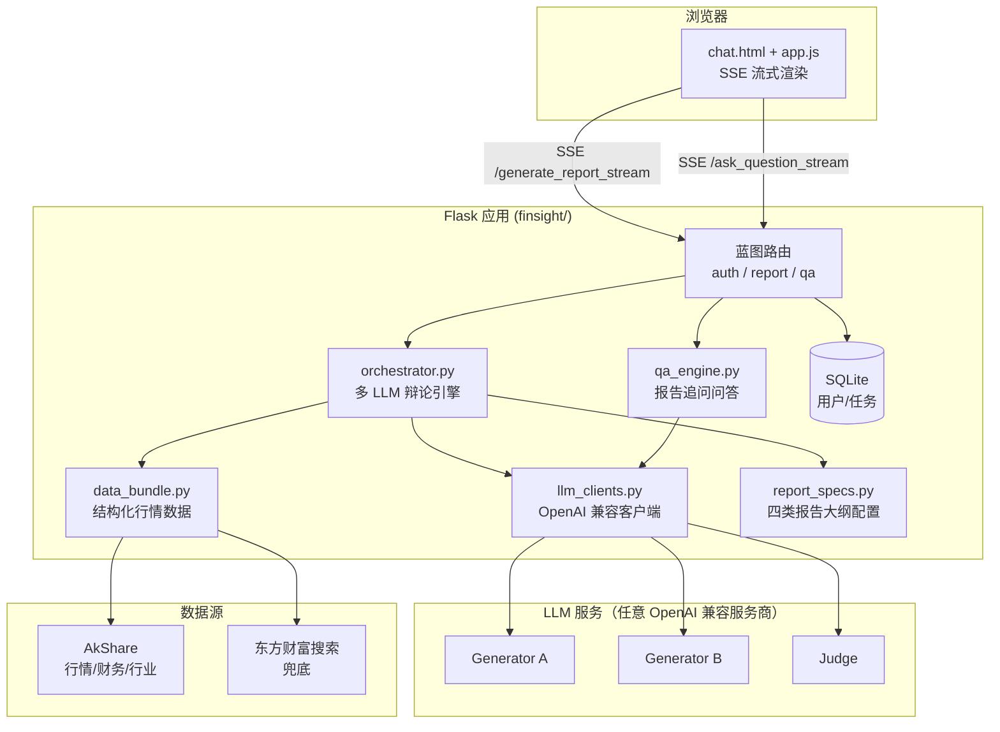
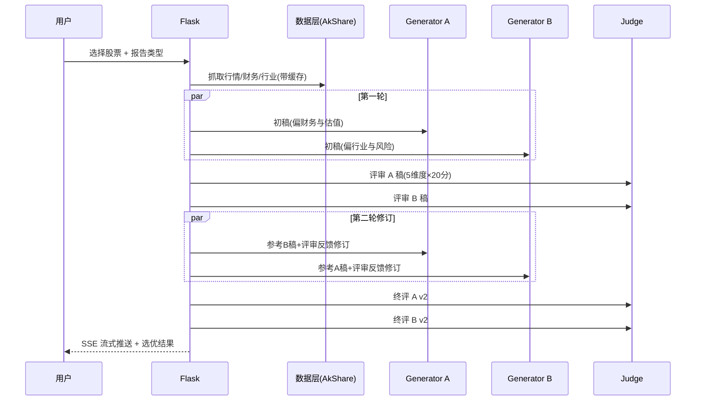

# 架构说明

## 总体架构



## 多 LLM 辩论生成流程



## 关键设计

### 1. 辩论式生成（orchestrator.py）

- **双视角初稿**：Generator A 偏财务估值视角，Generator B 偏行业风险视角，减少单模型盲区。
- **结构化评审**：Judge 按 5 维度（数据忠实度/逻辑/清晰度/风险揭示/合规性）打分，输出 JSON。
- **交叉修订**：每个生成器可见对手稿件与评审反馈后修订，第二轮得分更高者胜出。
- **全程回退**：双稿失败 → 基于 AkShare 结构化数据生成回退报告；评审失败 → 使用固定兜底评分。

### 2. 数据层（data_bundle.py）

- 每个数据组件（spot/history/financial/industry/web_search）独立缓存 30 分钟（可配置）。
- 单组件失败不影响其他组件，最终在报告生成时按可用数据裁剪。
- 代码规范化支持沪深京三市 6 位代码。

### 3. 合规约束（内置于提示词）

- 禁止编造数据：模型必须在数据缺失时明确说明，而非虚构数值。
- 禁止确定性收益承诺："稳赚""确定上涨"等表达被显式禁止。
- 所有报告尾部自动附带免责声明。
- Judge 评分维度中 `compliance` 专门约束合规表达。

### 4. 密钥管理

- 所有 API Key 通过 `.env` 注入（见 `.env.example`），源码零硬编码。
- 支持主备双 Key 自动切换（401 时降级）。

## 目录结构

```
finsightpro/
├── finsight/               # Flask 主包
│   ├── __init__.py         # create_app 工厂
│   ├── config.py           # 配置中心（读 .env）
│   ├── extensions.py       # db 实例
│   ├── models.py           # ORM 模型
│   ├── routes/             # auth / report / qa 蓝图
│   ├── services/           # 业务服务层
│   ├── static/             # js / logo
│   └── templates/          # 页面模板
├── finetune/               # 微调脚本（train.py / infer.py）
├── data/                   # 微调训练数据（4 个分项）
├── docs/                   # 文档 + 示例报告
├── tests/                  # 测试
├── run.py                  # 启动入口
└── requirements.txt
```

## 历史演进说明

本项目源自一个学术课题的早期版本，该版本曾包含两条并行的报告生成链路：

1. **MetaGPT 多智能体 + RAG 引擎**：基于 MetaGPT 框架、ChromaDB 向量库、智谱
   embedding 与 Bocha 网络搜索构建的多角色协作系统。
2. **多 LLM 辩论引擎**（现架构）：双生成器 + 评审官的无状态辩论编排。

开源版本仅保留第 2 条链路——它不依赖任何重型框架、无需向量库运维、
推理链路完全可复现，且在实测中产出质量更稳定。第 1 条链路的设计思路
保留在本文档中作为历史参考；如需研究多智能体协作模式，可参考 MetaGPT
官方仓库自行扩展（扩展点：`finsight/services/orchestrator.py` 中的
生成器角色抽象）。

## v2.1 深度升级：多空对抗辩论引擎

本版本将原「双生成器平行写作」机制升级为可配置的辩论引擎（`DEBATE_MODE`）：

- **adversarial（默认）**：Generator A 扮演**多头研究员**（挖掘成长逻辑与催化因素），Generator B 扮演**空方/风控研究员**（审查风险、估值泡沫与治理隐患）。第二轮修订中双方必须正面回应对手论点（用数据反驳或审慎吸收），Judge 以中立仲裁人身份按五维标准（数据扎实/逻辑/清晰度/风险揭示/合规，各 20 分）评分。
- **parallel**：保留原始平行视角模式。

配套前端能力：

1. **辩论过程透明化面板**：四份稿件（两轮×双方）各自得分、优势与短板、最终胜者，以及多空双方终稿的五维评分雷达图（ECharts）。
2. **行情图表**：基于 AkShare 真实行情的日 K 线 + 成交量图（涨红跌绿，遵循 A 股惯例）。
3. **全市场股票搜索**：沪/深/北三市代码与名称模糊搜索（本地 6 小时缓存底表），不再局限于预设股票。
4. **历史报告中心**：列出全部已生成报告及其最终评分，一键回看。
5. **XSS 防护**：所有 Markdown 渲染统一经 DOMPurify 消毒。
6. **真流式输出**：`stream=true` 逐 token 推送（SSE），服务商不支持时自动回退模拟分块。
